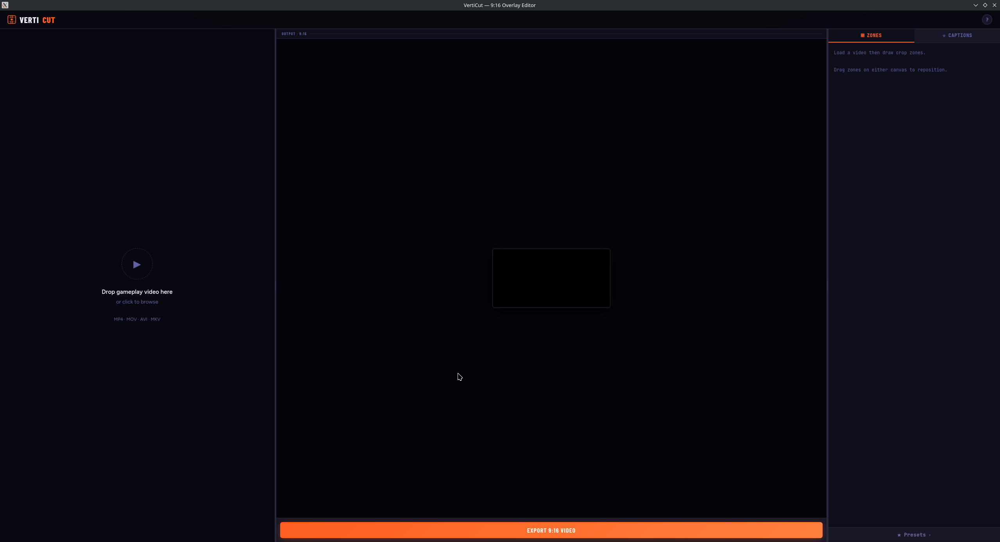
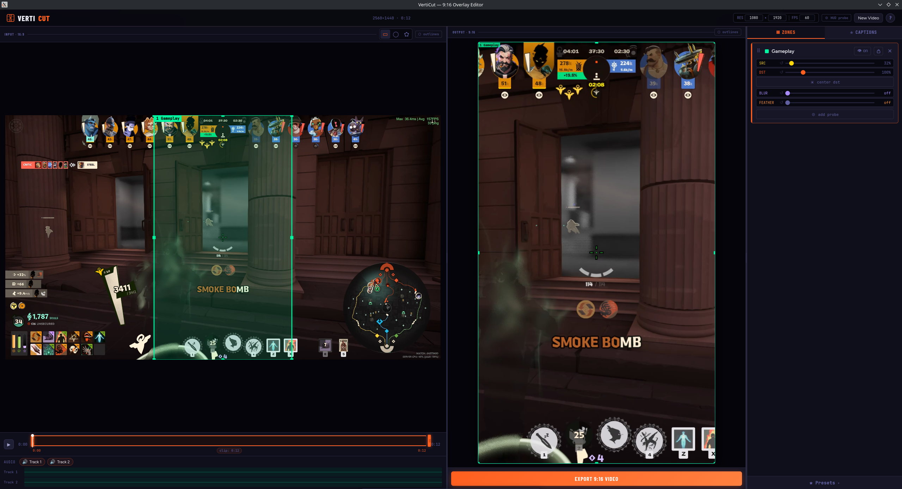
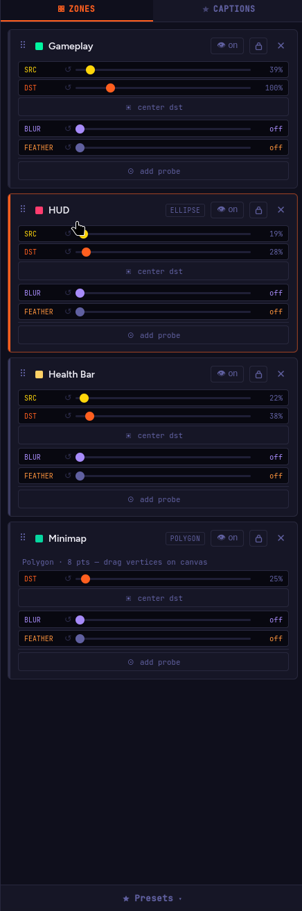
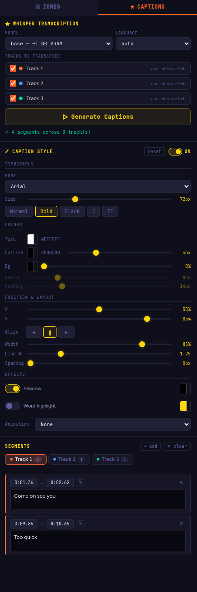

<div align="center">
  
  <h1>VertiCut</h1>
  <p><strong>9:16 Vertical Gaming Video Editor</strong></p>
  <p>A desktop app for turning landscape gaming footage into vertical short-form content (YouTube Shorts, TikTok, Reels).</p>
  
  [](https://github.com/Sirsyorrz/verticut/releases)
</div>

Built with Electron + FFmpeg. No cloud, no subscription, no internet required. Fully portable — one `.exe`, nothing to install.

---

## 🚀 Download

Grab the latest portable `.exe` from [**Releases**](https://github.com/Sirsyorrz/verticut/releases) — just double-click and run.

---

## ✨ What's New

VertiCut has been freshly updated with a **completely redesigned UI** featuring a modern color scheme, updated typography, and layout polish.

Additionally, **Auto-Captions** are now supported! Powered by OpenAI's Whisper (via `faster-whisper`), you can generate accurate subtitles entirely offline. *(Note: Captions currently require an NVIDIA GPU with CUDA).*

---

## 📸 Screenshots

<div align="center">
  
  <br />
  
</div>

<br/>

<table align="center" width="100%">
  <tr>
    <td width="50%" align="center" valign="top">
      
      <br/><br/>
      <b>Precision Zone Editing</b>
    </td>
    <td width="50%" align="center" valign="top">
      
      <br/><br/>
      <b>Auto-Captions (Whisper)</b>
    </td>
  </tr>
</table>

---

## 🛠 Features

- **Auto-Captions (New)** — one-click subtitle generation using OpenAI Whisper (NVIDIA GPU only)
- **Modern UI Design (New)** — freshly redesigned dark scheme and layout
- **Multi-zone layout** — draw multiple crop regions on your source video and position them freely on a 9:16 canvas
- **Live preview** — real-time side-by-side preview of the source and 9:16 output while you edit
- **8-point resize handles** — drag any corner or edge of a zone to resize, drag center to reposition
- **Timeline trim** — drag in/out handles to export only the segment you want
- **Presets** — save and reuse layouts; update a saved preset with one click
- **Zone disable** — temporarily hide a crop zone from the output (👁 toggle) without deleting it
- **Multi-track audio** — detects all audio streams (game audio, mic, commentary), shows per-track mute toggles with live frequency visualizers, merges only un-muted tracks
- **Custom resolution & FPS** — export at any resolution, default 1080×1920 @ 60 fps
- **Portable** — single `.exe`, no installation, FFmpeg and Whisper bundled inside

---

## 📖 How to use

1. **Drop a video** onto the app (MP4, MOV, MKV, AVI…)
2. **Draw crop zones** by dragging on the source canvas — one for gameplay, one for HUD/facecam
3. **Position zones** on the 9:16 output canvas — drag, resize, or type exact pixel values
4. **Generate Captions** (optional) from the Captions tab using your NVIDIA GPU
5. **Trim** the timeline if you only want a clip
6. **Mute** any audio tracks you don't want in the export
7. Hit **Export 9:16 Video** — rendering happens locally, then the file downloads automatically

---

## ⚙️ Running from source

**Requirements:** 
- Node.js 18+
- NVIDIA GPU (if using Captions)

```bash
git clone https://github.com/Sirsyorrz/verticut.git
cd verticut
npm install

# Download required Whisper models/binaries
npm run download-whisper

npm start
```

### Build portable exe

```bash
npm run build
# Output → dist/VertiCut 1.6.0.exe
```

---

## 📁 Project structure

```
verticut/
├── main.js          ← Electron entry point
├── server/          ← Embedded Express + FFmpeg API & Whisper Handlers
├── package.json
├── static/          ← Frontend (Vanilla JS + HTML5 Canvas)
├── resources/       ← External binaries (like Whisper)
├── uploads/         ← Auto-created at runtime
└── outputs/         ← Auto-created at runtime
```

---

## 💻 Tech stack

| Layer | Tech |
|---|---|
| **Shell** | Electron |
| **Server** | Express + Multer |
| **Video Processing** | FFmpeg (`ffmpeg-static` / `ffprobe-static`) |
| **Captions** | faster-whisper |
| **Frontend** | Vanilla JS + HTML5 Canvas 2D |
| **Audio Preview** | Web Audio API (`AnalyserNode`) |

---

## 📄 License

MIT
