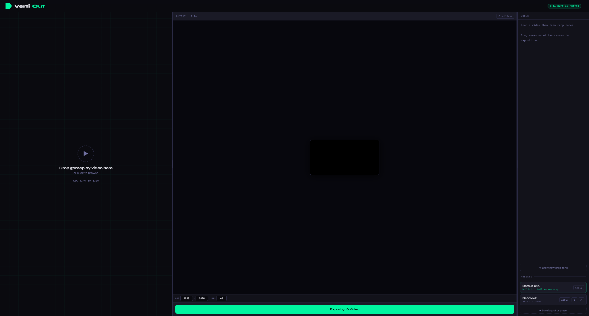
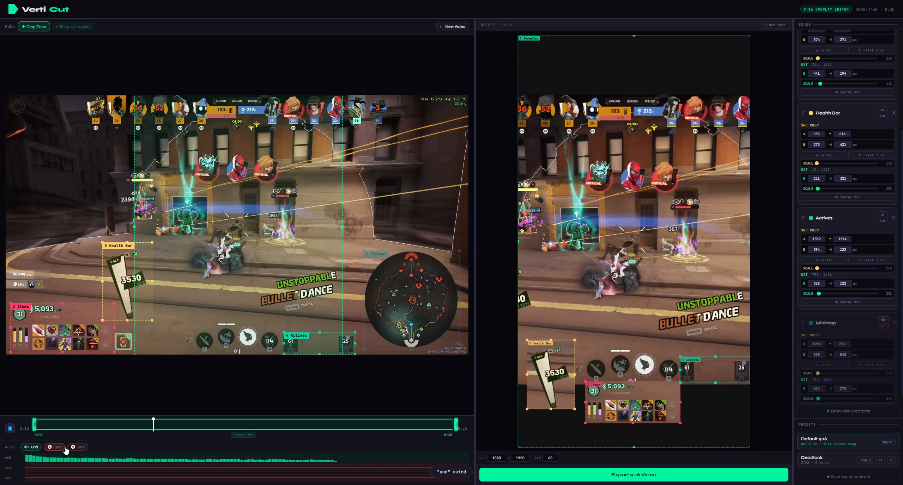

# VertiCut

**9:16 Vertical Gaming Video Editor** — a desktop app for turning landscape gaming footage into vertical short-form content (YouTube Shorts, TikTok, Reels).

Built with Electron + FFmpeg. No cloud, no subscription, no internet required. Fully portable — one `.exe`, nothing to install.

---

## Download

Grab the latest portable `.exe` from [**Releases**](https://github.com/Sirsyorrz/verticut/releases) — just double-click and run.

---

## Screenshots






---

## Features

- **Multi-zone layout** — draw multiple crop regions on your source video and position them freely on a 9:16 canvas
- **Live preview** — real-time side-by-side preview of the source and 9:16 output while you edit
- **8-point resize handles** — drag any corner or edge of a zone to resize, drag center to reposition
- **Timeline trim** — drag in/out handles to export only the segment you want
- **Presets** — save and reuse layouts; update a saved preset with one click (↺)
- **Default 9:16 preset** — auto-applied on video load so you can start editing immediately
- **Zone disable** — temporarily hide a crop zone from the output (👁 toggle) without deleting it
- **Multi-track audio** — detects all audio streams (game audio, mic, commentary, etc.), shows per-track mute toggles with live frequency visualizers, merges only un-muted tracks at export
- **Undo** — Ctrl+Z undoes any layout or zone change (50-step history)
- **Spacebar** — play / pause
- **Custom resolution & FPS** — export at any resolution, default 1080×1920 @ 60 fps
- **Portable** — single `.exe`, no installation, FFmpeg bundled inside

---

## How to use

1. **Drop a video** onto the app (MP4, MOV, MKV, AVI…)
2. **Draw crop zones** by dragging on the source canvas — one for gameplay, one for HUD, minimap, facecam, etc.
3. **Position zones** on the 9:16 output canvas — drag, resize, or type exact pixel values
4. **Trim** the timeline if you only want a clip
5. **Mute** any audio tracks you don't want in the export
6. Hit **Export 9:16 Video** — FFmpeg renders locally, then the file downloads automatically

---

## Output format

| Setting | Default |
|---|---|
| Resolution | 1080 × 1920 |
| FPS | 60 |
| Video codec | H.264 (libx264, CRF 18) |
| Audio codec | AAC 192k |
| Container | MP4 |

---

## Running from source

**Requirements:** Node.js 18+

```bash
git clone https://github.com/Sirsyorrz/verticut.git
cd verticut
npm install
npm start
```

### Build portable exe

```bash
npm run build
# Output → dist/VertiCut 1.0.0.exe
```

---

## Project structure

```
verticut/
├── main.js          ← Electron entry point
├── server.js        ← Embedded Express + FFmpeg API
├── package.json
├── static/
│   └── index.html   ← Entire frontend (vanilla JS + Canvas)
├── uploads/         ← Auto-created at runtime
└── outputs/         ← Auto-created at runtime
```

---

## Tech stack

| Layer | Tech |
|---|---|
| Shell | Electron 28 |
| Server | Express + Multer |
| Video processing | FFmpeg (`ffmpeg-static` / `ffprobe-static`) |
| Frontend | Vanilla JS + HTML5 Canvas 2D |
| Audio preview | Web Audio API — `AnalyserNode` per track |

---

## License

MIT
